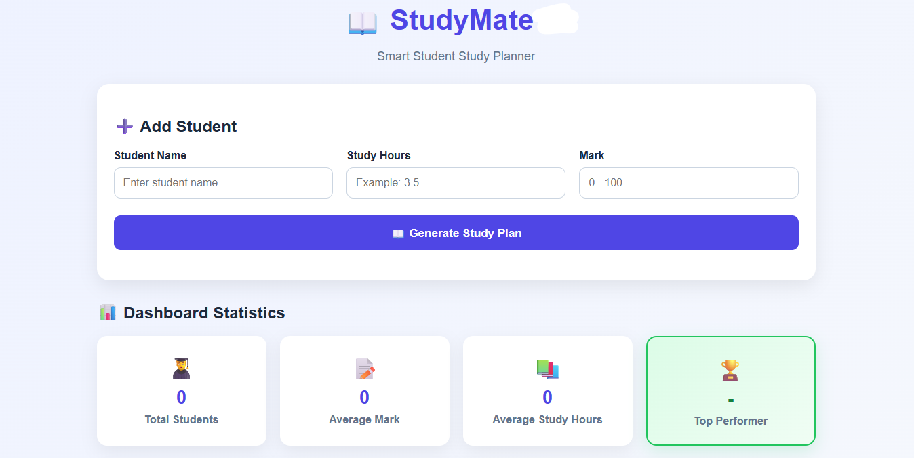

# 📖 Studymate

Studymate is a simple student study planner and performance management system built using **Python, FastAPI, SQLAlchemy, SQLite, HTML, CSS, and JavaScript**.

The application allows students to enter their study hours and marks. Based on the entered information, it provides a performance level, study suggestion, and study plan.

---

## 🔗 Live Demo

👉 **[studymate-ai-ay22.onrender.com](https://studymate-ai-ay22.onrender.com)**

> Hosted on Render's free tier — the first load after a period of inactivity may take 30–60 seconds to wake up. Since it's a free demo, added students may be reset periodically.



---

## ✨ Features

- 👨‍🎓 Add student details
- 📚 Store study hours
- 📝 Store student marks
- 🏆 Automatically calculate performance level
- 💡 Generate study suggestions
- 📖 Generate study plans
- 👀 View all students
- ✏️ Edit student information
- 🗑️ Delete student information
- 🔍 Search students by name
- 📈 Visual chart of student marks
- 💾 Store student data in SQLite database
- 🌐 FastAPI backend with HTML/CSS/JavaScript frontend

---

## 🛠️ Technologies Used

**Backend**
- Python
- FastAPI
- SQLAlchemy
- Pydantic
- Uvicorn

**Frontend**
- HTML
- CSS
- JavaScript
- Chart.js

**Database**
- SQLite

---

## 📂 Project Structure

```
Studymate/
│
├── main.py
├── database.py
├── models.py
├── frontend.html
├── requirements.txt
├── README.md
└── .gitignore
```

> **Note:** `studymate.db` will be created automatically when the application runs.

> ⚠️ **Important:** the frontend file must be named exactly `frontend.html` and must sit in the same folder as `main.py`. If it's missing or misnamed, the backend still runs, but shows a plain text message instead of the actual page.

---

## 📊 Performance Levels

| Mark      | Level             |
|-----------|-------------------|
| 90 - 100  | Excellent         |
| 75 - 89   | Very Good         |
| 50 - 74   | Good              |
| Below 50  | Needs Improvement |

---

## 📚 Study Suggestions

The application provides study suggestions based on the student's study hours.

| Study Hours | Suggestion                            |
|-------------|-----------------------------------------|
| 5 or more   | Keep up the good study routine!        |
| 3 to 4.9    | Try to increase your study hours.      |
| Below 3     | You need to spend more time studying.  |

---

## 📖 Study Plans

The application generates a study plan based on the student's marks.

| Mark      | Study Plan                                             |
|-----------|----------------------------------------------------------|
| 90+       | Revise important topics and practice mock tests.        |
| 75 - 89   | Spend 1 hour on revision and 1 hour on weak topics.      |
| 50 - 74   | Study 2 hours daily and practice important questions.    |
| Below 50  | Study 3 hours daily and focus more on weak subjects.     |

---

## 🚀 How to Run

### 1. Open the project folder
Open the `Studymate` project folder in VS Code.

### 2. Open a terminal
In VS Code, select:

```
Terminal → New Terminal
```

### 3. Install required packages

```bash
python -m pip install -r requirements.txt
```

### 4. Start the FastAPI server

```bash
python -m uvicorn main:app --reload
```

The backend will start at:

```
http://127.0.0.1:8000
```

### 5. Open the app
Go to this address directly in your browser:

```
http://127.0.0.1:8000
```

You should see the full Studymate page — the Add Student form, dashboard statistics, chart, and student list.

> ⚠️ **Do NOT** use VS Code's "Go Live" / Live Server button to open this project. Live Server only shows the raw HTML file and knows nothing about the backend or database, and its auto-reload can interrupt the page while you're using it. Always use the `http://127.0.0.1:8000` address above instead — the FastAPI server serves both the page and the data from that one address.

### 6. Check the API directly (optional)

```
http://127.0.0.1:8000/api
```

You should see:

```json
{"message": "StudyMate API is working!"}
```

### 7. Open the API documentation (optional)
FastAPI provides automatic API documentation:

```
http://127.0.0.1:8000/docs
```

You can use the Swagger UI to test the API endpoints directly.

---

## 🔗 API Endpoints

| Method | Endpoint                | Description         |
|--------|---------------------------|-----------------------|
| GET    | `/api`                     | Check API status     |
| POST   | `/student`                 | Add a new student     |
| GET    | `/students`                | Get all students      |
| PUT    | `/student/{student_id}`    | Update a student      |
| DELETE | `/student/{student_id}`    | Delete a student      |

---

## 🗄️ Database

Studymate uses **SQLite** as its database.

The database file is:

```
studymate.db
```

The database stores student information such as:

- Student name
- Study hours
- Mark
- Performance level
- Study suggestion

---

## 🔮 Future Improvements

Possible future improvements include:

- 🤖 AI-powered personalized study recommendations
- 📅 Automatic daily and weekly study schedules
- 📈 Student performance charts (basic version already included)
- 🔐 User login and authentication
- 📱 Mobile-friendly design
- 📊 Subject-wise marks tracking
- ⏰ Study reminders
- 📄 PDF report generation
- ☁️ Cloud database integration

---

## 🎯 Project Goal

The main goal of Studymate is to help students understand their academic performance and improve their study habits.

This project also demonstrates how a frontend application can communicate with a FastAPI backend and store data using SQLAlchemy and SQLite.

---

## 📄 License

This project is created for educational and learning purposes.
